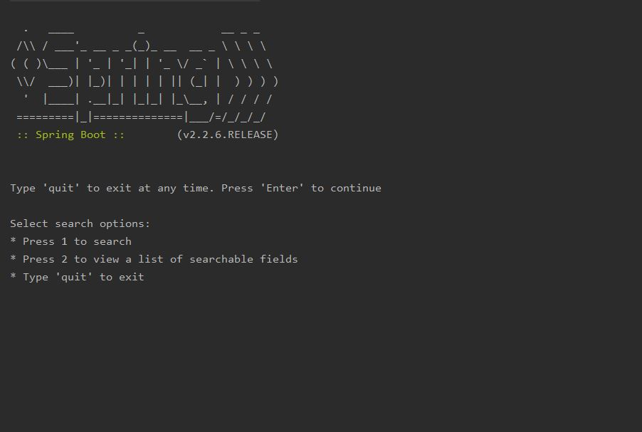
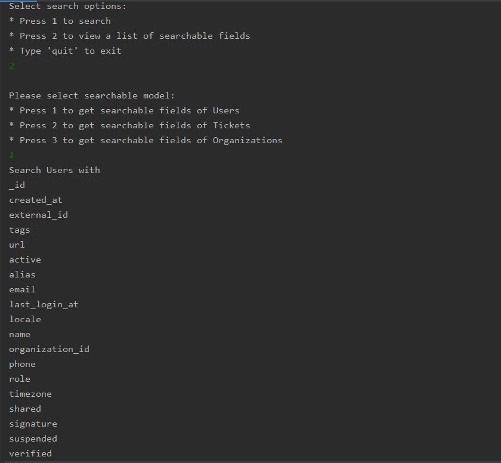

# Command Line Application using Spring Boot
A command line application to search the data and return the results in a human readable format. Using Spring Boot to build this application.
* Feel free to use libraries or roll your own code as you see fit.
* Where the data exists, values from any related entities **MUST** be included in the results, i.e.
  * Searching **organization MUST** return its **ticket subject** and **users name**.
  * Searching **users MUST** return his/her **assignee ticket subject** and **submitted ticket subject** and his/her
  **organization name**.
  * Searching **tickets MUST** return its **assignee name**, **submitter name**, **and organization name**.
* The user should be able to search on any field, full value matching is fine (e.g. "mar" won't return "mary").
* The user should also be able to search for empty values, e.g. where description is empty.
* Search can get pretty complicated pretty easily, we just want to see that you can code a basic search application.

## Solution
- When starting the application, read data from JSON files and then parse it to object by using Object Mapper and save it to corresponding Map.
- Because we must be able to search all fields in the fastest way, so I'm using Map to reduce the complexity time. The trade-off is that it will take a lot of time when starting the application.

## Technologies are used in the project
1. Spring Boot version ``2.2.6``
2. Maven to manage dependency and build project
3. Code quality assurance with PMD
4. Libraries: Lombok ``1.18.12``, Jackson ``2.10.3``
5. Setup test coverage with Jacoco

## Class Diagram


## How to start project?
1. Build the project with this command line: ```mvn clean install```


2. Run the jar file under the /core-service/target folder: ```java -jar core-service.jar```


## Example
### Search user by user id


### Not Found


### Searchable fields of user


### Error


## Test Coverage - ``80%``
- Use ``Mockito`` to write unit tests for repositories and services ``Done``
- Write integration test for scanner handlers **TO Be Updated**

## Code Quality - ``Passed``
- PMD

## Project Structure
```
command-line-application
├───core-domain
│   ├───codequality: Defines PMD rules
│   ├───src
│   │   └───main
│   │       └───java
│   │           └───com.ntatvr.domain
│   │                       └───entities: Contains Entities of the application
├───core-service
│   ├───codequality: Defines PMD rules
│   ├───src
│   │   ├───main
│   │   │   ├───java
│   │   │   │   └───com.ntatvr.core
│   │   │   │               ├───config: Includes all configuration
│   │   │   │               ├───exceptions: Includes exception defined
│   │   │   │               ├───repositories: Take the responsibility of read data from JSON.json files under
│   │   │   │               │       the resource folder and save it to it to corresponding Map.
│   │   │   │               ├───scanner
│   │   │   │               │   └───search: Receive the input from console and then execute corresponding functions.
│   │   │   │               ├───services
│   │   │   │               └───utils: Includes some utils class such as MapUtils, Validator
│   │   │   └───resources
│   │   │       └───data: JSON files
│   │   │       └───application.yaml: Application settings
│   │   └───test: test classes
└───external-image: Contains diagrams and some example images
```

## Issues
- The challenge file that you give me is a binary file and seems like it was written in MAC OS and it can't be run in
 Window OS. Therefore, I will build an application based on the instructions in the instructions.pdf file.
